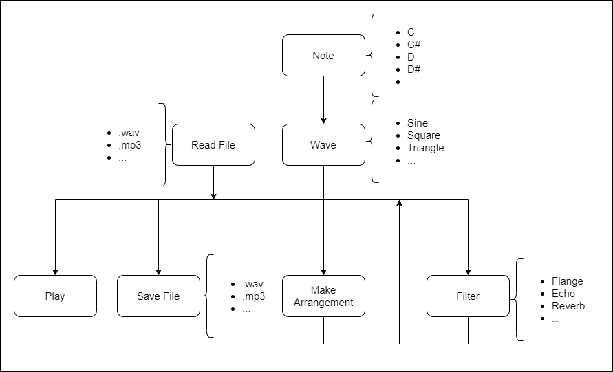

# Project 3: Software Architecture Design Choices Group B

Team: Maxime PAGES, Pierre GORIN, Paul MARIS, Laurent BOUQUIN, Florent HUREAUX, Arthur LEMOINE

## 1. Software Architecture Diagram

The program architecture is planned as shown above, first we create Notes which are just frequences, after we associate them with a wave depending on the wanted sound (Sine, Square, ...), then we can apply a filters (Flange, Echo, Reverb, ...) or store some notes in an arrangement wich we can apply filter one, save in a file (mp3, wav, ...) or directly play it.

An other way to use the program would be load a sound from the device storage in order to modify it and then save or play the result.

## 2. Programmation Language

As a requirement from the client, this application will have to be build in F#

## 3. Code choices

In the early programming hours of the project we settle on some naming conventions to keep the code clean and uniform

- variables -> camelCase
- functions -> PascalCase
